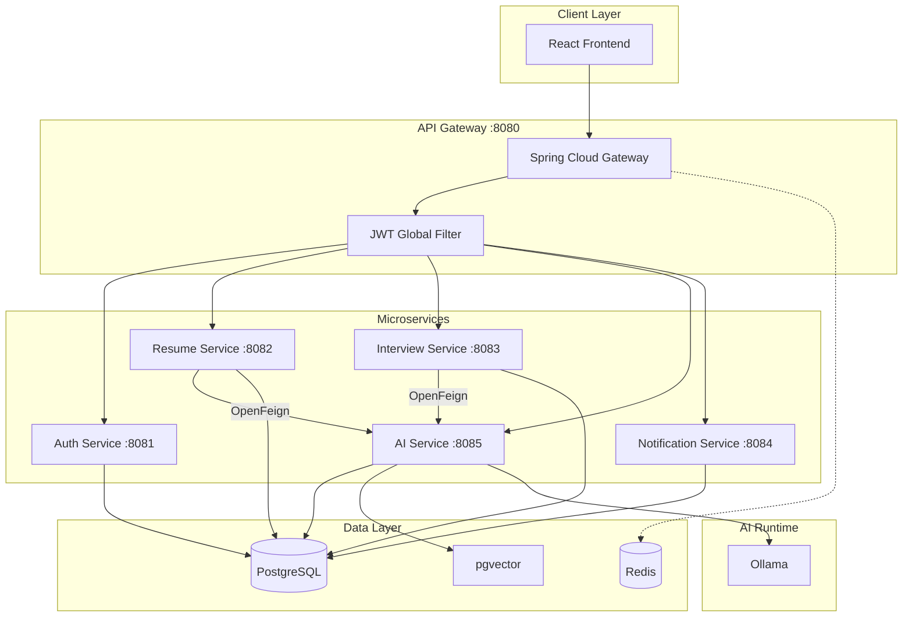

# Architecture

## Service Responsibilities

| Service | Database | Core Responsibility |
|---------|----------|---------------------|
| auth-service | auth_db | Registration, login, JWT issuance |
| resume-service | resume_db | File upload, text extraction, ATS scoring |
| interview-service | interview_db | Sessions, Q&A persistence, analytics |
| ai-service | ai_db | LLM calls, embeddings, RAG retrieval |
| notification-service | notification_db | User notifications, email |
| gateway-service | — | Routing, CORS, JWT validation |
